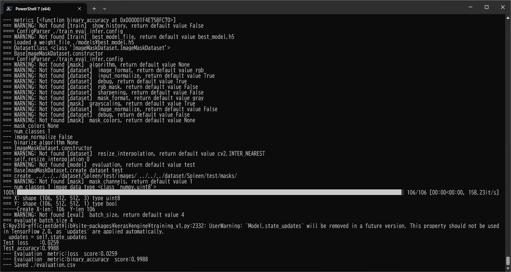

<h2>Tensorflow-Image-Segmentation-Augmented-Spleen (2024/05/13)</h2>

This is an experimental Image Segmentation project for Spleen based on
the <a href="https://github.com/sarah-antillia/Tensorflow-Image-Segmentation-API">Tensorflow-Image-Segmentation-API</a>, and
<a href="https://drive.google.com/file/d/1uFdvbuDOLHhNvgDC8MR9TZalTBrbim3J/view?usp=sharing">
Spleen-ImageMask-Dataset_V2.zip</a> 
 

 

Actual Image Segmentation Example 
<table>
<tr>
<th width="330">Input: image</th>
<th width="330">Mask (ground_truth)</th>
<th width="330">Prediction: inferred_mask_merged</th>
</tr>
<tr>
<td></td>
<td></td>
<td></td>
</tr>

</table>

 

In order to improve segmentation accuracy, we used an online dataset augmentation strategy based on Python script <a href="./src/ImageMaskAugmentor.py">
ImageMaskAugmentor.py</a> to train a Spleen Segmentation Model. 
 
As the first trial, we used the simple UNet Model 
<a href="./src/TensorflowUNet.py">TensorflowSlightlyFlexibleUNet</a> for this Spleen Segmentation. 
As shown in <a href="https://github.com/sarah-antillia/Tensorflow-Image-Segmentation-API">Tensorflow-Image-Segmentation-API</a>.
you may try other Tensorflow UNet Models: 

<li><a href="./src/TensorflowSwinUNet.py">TensorflowSwinUNet.py</a></li>
<li><a href="./src/TensorflowMultiResUNet.py">TensorflowMultiResUNet.py</a></li>
<li><a href="./src/TensorflowAttentionUNet.py">TensorflowAttentionUNet.py</a></li>
<li><a href="./src/TensorflowEfficientUNet.py">TensorflowEfficientUNet.py</a></li>
<li><a href="./src/TensorflowUNet3Plus.py">TensorflowUNet3Plus.py</a></li>
<li><a href="./src/TensorflowDeepLabV3Plus.py">TensorflowDeepLabV3Plus.py</a></li>

 

<h3>1. Dataset Citation</h3>

The original image dataset used here has been taken from the google drive. 
<a href="https://drive.google.com/file/d/1jzeNU1EKnK81PyTsrx0ujfNl-t0Jo8uE/view?usp=drive_link">Task09_Spleen.tar</a>
uploaded by 
<a href="http://medicaldecathlon.com/">Medical Segmentation Decathlon</a>
 
 
<b>About Dataset</b>
<pre>
{ 
"name": "Spleen", 
"description": "Spleen Segmentation",
"reference": "Memorial Sloan Kettering Cancer Center",
"licence":"CC-BY-SA 4.0",
"release":"1.0 06/08/2018",
"tensorImageSize": "3D",
"modality": { 
   "0": "CT"
 }, 
 "labels": { 
   "0": "background", 
   "1": "spleen"
 }, 
 "numTraining": 41, 
 "numTest": 20,
 "training":[{"image":"./imagesTr/spleen_19.nii.gz","label":"./labelsTr/spleen_19.nii.gz"},{"image":"./imagesTr/spleen_31.nii.gz","label":"./labelsTr/spleen_31.nii.gz"},{"image":"./imagesTr/spleen_52.nii.gz","label":"./labelsTr/spleen_52.nii.gz"},{"image":"./imagesTr/spleen_40.nii.gz","label":"./labelsTr/spleen_40.nii.gz"},{"image":"./imagesTr/spleen_3.nii.gz","label":"./labelsTr/spleen_3.nii.gz"},{"image":"./imagesTr/spleen_17.nii.gz","label":"./labelsTr/spleen_17.nii.gz"},{"image":"./imagesTr/spleen_21.nii.gz","label":"./labelsTr/spleen_21.nii.gz"},{"image":"./imagesTr/spleen_33.nii.gz","label":"./labelsTr/spleen_33.nii.gz"},{"image":"./imagesTr/spleen_9.nii.gz","label":"./labelsTr/spleen_9.nii.gz"},{"image":"./imagesTr/spleen_29.nii.gz","label":"./labelsTr/spleen_29.nii.gz"},{"image":"./imagesTr/spleen_46.nii.gz","label":"./labelsTr/spleen_46.nii.gz"},{"image":"./imagesTr/spleen_25.nii.gz","label":"./labelsTr/spleen_25.nii.gz"},{"image":"./imagesTr/spleen_13.nii.gz","label":"./labelsTr/spleen_13.nii.gz"},{"image":"./imagesTr/spleen_62.nii.gz","label":"./labelsTr/spleen_62.nii.gz"},{"image":"./imagesTr/spleen_27.nii.gz","label":"./labelsTr/spleen_27.nii.gz"},{"image":"./imagesTr/spleen_44.nii.gz","label":"./labelsTr/spleen_44.nii.gz"},{"image":"./imagesTr/spleen_56.nii.gz","label":"./labelsTr/spleen_56.nii.gz"},{"image":"./imagesTr/spleen_60.nii.gz","label":"./labelsTr/spleen_60.nii.gz"},{"image":"./imagesTr/spleen_2.nii.gz","label":"./labelsTr/spleen_2.nii.gz"},{"image":"./imagesTr/spleen_53.nii.gz","label":"./labelsTr/spleen_53.nii.gz"},{"image":"./imagesTr/spleen_41.nii.gz","label":"./labelsTr/spleen_41.nii.gz"},{"image":"./imagesTr/spleen_22.nii.gz","label":"./labelsTr/spleen_22.nii.gz"},{"image":"./imagesTr/spleen_14.nii.gz","label":"./labelsTr/spleen_14.nii.gz"},{"image":"./imagesTr/spleen_18.nii.gz","label":"./labelsTr/spleen_18.nii.gz"},{"image":"./imagesTr/spleen_20.nii.gz","label":"./labelsTr/spleen_20.nii.gz"},{"image":"./imagesTr/spleen_32.nii.gz","label":"./labelsTr/spleen_32.nii.gz"},{"image":"./imagesTr/spleen_16.nii.gz","label":"./labelsTr/spleen_16.nii.gz"},{"image":"./imagesTr/spleen_12.nii.gz","label":"./labelsTr/spleen_12.nii.gz"},{"image":"./imagesTr/spleen_63.nii.gz","label":"./labelsTr/spleen_63.nii.gz"},{"image":"./imagesTr/spleen_28.nii.gz","label":"./labelsTr/spleen_28.nii.gz"},{"image":"./imagesTr/spleen_24.nii.gz","label":"./labelsTr/spleen_24.nii.gz"},{"image":"./imagesTr/spleen_59.nii.gz","label":"./labelsTr/spleen_59.nii.gz"},{"image":"./imagesTr/spleen_47.nii.gz","label":"./labelsTr/spleen_47.nii.gz"},{"image":"./imagesTr/spleen_8.nii.gz","label":"./labelsTr/spleen_8.nii.gz"},{"image":"./imagesTr/spleen_6.nii.gz","label":"./labelsTr/spleen_6.nii.gz"},{"image":"./imagesTr/spleen_61.nii.gz","label":"./labelsTr/spleen_61.nii.gz"},{"image":"./imagesTr/spleen_10.nii.gz","label":"./labelsTr/spleen_10.nii.gz"},{"image":"./imagesTr/spleen_38.nii.gz","label":"./labelsTr/spleen_38.nii.gz"},{"image":"./imagesTr/spleen_45.nii.gz","label":"./labelsTr/spleen_45.nii.gz"},{"image":"./imagesTr/spleen_26.nii.gz","label":"./labelsTr/spleen_26.nii.gz"},{"image":"./imagesTr/spleen_49.nii.gz","label":"./labelsTr/spleen_49.nii.gz"}],
 "test":["./imagesTs/spleen_15.nii.gz","./imagesTs/spleen_23.nii.gz","./imagesTs/spleen_1.nii.gz","./imagesTs/spleen_42.nii.gz","./imagesTs/spleen_50.nii.gz","./imagesTs/spleen_54.nii.gz","./imagesTs/spleen_37.nii.gz","./imagesTs/spleen_58.nii.gz","./imagesTs/spleen_39.nii.gz","./imagesTs/spleen_48.nii.gz","./imagesTs/spleen_35.nii.gz","./imagesTs/spleen_11.nii.gz","./imagesTs/spleen_7.nii.gz","./imagesTs/spleen_30.nii.gz","./imagesTs/spleen_43.nii.gz","./imagesTs/spleen_51.nii.gz","./imagesTs/spleen_36.nii.gz","./imagesTs/spleen_55.nii.gz","./imagesTs/spleen_57.nii.gz","./imagesTs/spleen_34.nii.gz"]
 }

</pre>
 

<h3>
<a id="2">
2 Spleen ImageMask Dataset
</a>
</h3>
 If you would like to train this Spleen Segmentation model by yourself,
 please download the dataset from the google drive 
<a href="https://drive.google.com/file/d/1uFdvbuDOLHhNvgDC8MR9TZalTBrbim3J/view?usp=sharing">
Spleen-ImageMask-Dataset_V2.zip</a>.
Please see also <a href="https://github.com/sarah-antillia/ImageMask-Dataset-Spleen">ImageMask-Dataset-Spleen</a>. 
 

 
Please expand the downloaded ImageMaskDataset and place them under <b>./dataset</b> folder to be

<pre>
./dataset
└─Spleen
    ├─test
    │  ├─images
    │  └─masks
    ├─train
    │  ├─images
    │  └─masks
    └─valid
        ├─images
        └─masks
</pre>

Train images sample 
.  
Train masks sample 
.  

  
<b>Spleen Dataset Statistics</b> 
 

As shown above, the number of images of train and valid dataset is not necessarily large. Therefore the online dataset augmentation strategy may 
be effective to improve segmentation accuracy.

 

<h3>
<a id="3">
3 TensorflowSlightlyFlexibleUNet
</a>
</h3>
This <a href="./src/TensorflowUNet.py">TensorflowUNet</a> model is slightly flexibly customizable by a configuration file. 
For example, <b>TensorflowSlightlyFlexibleUNet/Spleen</b> model can be customizable
by using <a href="./projects/TensorflowSlightlyFlexibleUNet/Spleen/train_eval_infer.config">train_eval_infer.config</a>
<pre>
; train_eval_infer.config
; 2024/05/13 (C) antillia.com

[model]
model          = "TensorflowUNet"
generator      = True
image_width    = 512
image_height   = 512
image_channels = 3
num_classes    = 1
base_filters   = 16
base_kernels   = (5,5)
num_layers     = 7
dropout_rate   = 0.05
learning_rate  = 0.0001
clipvalue      = 0.5
dilation       = (2,2)
loss           = "bce_dice_loss"
metrics        = ["binary_accuracy"]
show_summary   = False

[dataset]
;Please specify a claSss name of your ImageDataset.
datasetclass  = "ImageMaskDataset"
color_order   = "bgr"

[train]
epochs           = 100
batch_size       = 4
steps_per_epoch  = 200
validation_steps = 100
patience       = 10
;metrics       = ["iou_coef", "val_iou_coef"]
metrics        = ["binary_accuracy", "val_binary_accuracy"]
model_dir      = "./models"
eval_dir       = "./eval"
image_datapath = "../../../dataset/Spleen/train/images/"
mask_datapath  = "../../../dataset/Spleen/train/masks/"
create_backup  = False
learning_rate_reducer = True
reducer_patience      = 4
save_weights_only     = True

[eval]
image_datapath = "../../../dataset/Spleen/valid/images/"
mask_datapath  = "../../../dataset/Spleen/valid/masks/"

[test] 
image_datapath = "../../../dataset/Spleen/test/images/"
mask_datapath  = "../../../dataset/Spleen/test/masks/"

[infer] 
images_dir    = "./mini_test/images/"
output_dir    = "./mini_test_output"
merged_dir    = "./mini_test_output_merged"

[segmentation]
colorize      = True
black         = "black"
white         = "green"
blursize      = None

[mask]
blur      = True
blur_size = (3,3)
binarize  = True
threshold = 128

[generator]
debug        = True
augmentation = True

[augmentor]
vflip       = False
hflip       = True
rotation    = True
angles      = [5,10,350,355]
shrinks     = [0.8]
shears      = [0.1]
deformation = True
distortion  = True

[deformation]
alpah    = 1300
sigmoid  = 8

[distortion]
gaussian_filter_rsigma= 40
gaussian_filter_sigma = 0.5
distortions           = [0.03,]
</pre>

Please note that the online augementor <a href="./src/ImageMaskAugmentor.py">
ImageMaskAugmentor.py</a> reads the parameters in [generator] and [augmentor] sections, 
and yields some images and mask depending on the batch_size,
 which are used for each epoch of the training and evaluation process of this UNet Model. 
<pre>
[augmentor]
vflip       = False
hflip       = True
rotation    = True
angles      = [5,10,350,355]
shrinks     = [0.8]
shears      = [0.1]
deformation = True
distortion  = True

[deformation]
alpah    = 1300
sigmoid  = 8

[distortion]
gaussian_filter_rsigma= 40
gaussian_filter_sigma = 0.5
distortions           = [0.03,]
</pre>
Depending on these parameters in [augmentor], [deformation], and [distortion] sections, ImageMaskAugmentor.py generates hflipped, rotated, shrinked,
sheared, deformed and distorted images and masks
from the original images and masks in the folders specified by image_datapath and mask_datapath in 
[train] and [eval] sections. 
<pre>
[train]
image_datapath = "../../../dataset/Spleen/train/images/"
mask_datapath  = "../../../dataset/Spleen/train/masks/"
[eval]
image_datapath = "../../../dataset/Spleen/valid/images/"
mask_datapath  = "../../../dataset/Spleen/valid/masks/"
</pre>

On deformation and distortion, please see also 
<a href="https://github.com/sarah-antillia/ImageMask-Dataset-Offline-Augmentation-Tool">
ImageMask-Dataset-Offline-Augmentation-Tool.</a>.
 

<h3>
3.1 Training
</h3>
Please move to a <b>./projects/TensorflowSlightlyFlexibleUNet/Spleen</b> folder, 
and run the following bat file to train TensorflowUNet model for Spleen. 
<pre>
./1.train.bat
</pre>
, which simply runs <a href="./src/TensorflowUNetTrainer.py">TensorflowUNetGeneratorTrainer.py </a>
in the following way.

<pre>
python ../../../src/TensorflowUNetTrainer.py ./train_eval_infer.config
</pre>

The following debug setting is helpful whether your parameters in [augmentor] section are good or not good.
<pre>
[generator]
debug     = True
</pre>
You can check the yielded images and mask files used in the actual train-eval process in the following folders under
<b>./projects/TensorflowSlightlyFlexibleUNet/Spleen/</b>.  
<pre>
generated_images_dir
generated_masks_dir
</pre>
<!--
Sample images in generated_images_dir 
 
Sample masks in generated_masks_dir 
 
-->
 
Train console output: 
 

 
<a href="./projects/TensorflowSlightlyFlexibleUNet/Spleen/eval/train_metrics.csv">train_metrics.csv</a> 
 

 
<a href="./projects/TensorflowSlightlyFlexibleUNet/Spleen/eval/train_losses.csv">train_losses.csv</a> 
 
 

<h3>
3.2 Evaluation
</h3>
Please move to a <b>./projects/TensorflowSlightlyFlexibleUNet/Spleen</b> folder, 
and run the following bat file to evaluate TensorflowUNet model for Spleen. 
<pre>
./2.evaluate.bat
</pre>
<pre>
python ../../../src/TensorflowUNetEvaluator.py ./train_eval_infer_aug.config
</pre>
Evaluation console output: 

 
<a href="./projects/TensorflowSlightlyFlexibleUNet/Spleen/evaluation.csv">evaluation.csv</a> 
The loss (bce_dice_loss) score for this test dataset is very low, and accuracy very heigh as shown below. 
<pre>
loss,0.0259
binary_accuracy,0.9988
</pre>

<h2>
3.3 Inference
</h2>
Please move to a <b>./projects/TensorflowSlightlyFlexibleUNet/Spleen</b> folder 
,and run the following bat file to infer segmentation regions for images by the Trained-TensorflowUNet model for Spleen. 
<pre>
./3.infer.bat
</pre>
<pre>
python ../../../src/TensorflowUNetInferencer.py ./train_eval_infer_aug.config
</pre>

Sample test images 
 
Sample test mask (ground_truth) 
 

 

Inferred test masks (colorized as green) 
 
 
Merged test images and inferred masks  
  

<b>Enlarged images and masks</b> 

<table>
<tr>
<th>Image</th>
<th>GroundTruth</th>
<th>Inferred-mask-merged</th>
</tr>

<tr>
<td></td>
<td></td>
<td></td>
</tr>

<tr>
<td></td>
<td></td>
<td></td>
</tr>

<tr>
<td></td>
<td></td>
<td></td>
</tr>
<tr>
<td></td>
<td></td>
<td></td>
</tr>
<tr>
<td></td>
<td></td>
<td></td>
</tr>

</table>
 

<h3>
References
</h3>

<b>1. Evaluation of a Deep Learning Algorithm for Automated Spleen Segmentation in Patients with Conditions Directly or Indirectly Affecting the Spleen.
</b> 
 Tomography. 2021 Dec 13;7(4):950-960. doi: 10.3390/tomography7040078. PMID: 34941650; PMCID: PMC8704906. 
Meddeb A, Kossen T, Bressem KK, Hamm B, Nagel SN.  
<pre>
https://www.ncbi.nlm.nih.gov/pmc/articles/PMC8704906/
</pre>

<b>2. Fully automated deep learning based auto-contouring of liver segments and spleen on contrast-enhanced CT images</b> 
Gupta, A.C., Cazoulat, G., Al Taie, M. et al. 
Sci Rep 14, 4678 (2024).  
<pre>
https://doi.org/10.1038/s41598-024-53997-y
</pre>

<b>3. ImageMask-Dataset-Spleen </b> 
Toshiyuki Arai antillia.com 
<pre>
https://github.com/sarah-antillia/ImageMask-Dataset-Spleen
</pre>

